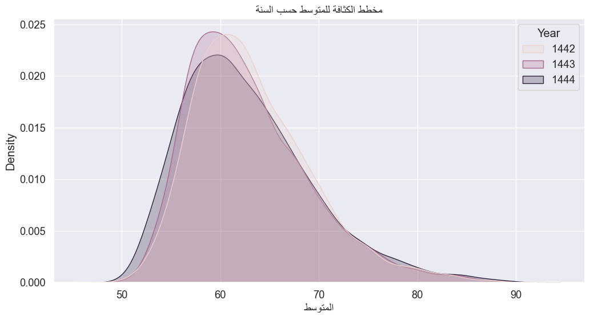

# تحليل نتائج الطلاب في اختبارات قياس
# Data Analysis of Students Results in Qiyas

## نظرة عامة | Overview
تحليل بيانات أداء الطلاب من قياس (المركز الوطني للقياس) في المملكة العربية السعودية. يتضمن التحليل دراسة درجات الاختبار والتوزيعات الإقليمية وأداء الإدارات التعليمية في جميع أنحاء المملكة.

Analysis of student performance data from Qiyas (القياس), the Saudi Arabian National Center for Assessment. The analysis includes examination of test scores, regional distributions, and educational department performance across Saudi Arabia.

## محتويات المشروع | Project Contents
- [المتطلبات والتثبيت | Requirements & Installation](#المتطلبات-والتثبيت--requirements--installation)
- [الاستخدام | Usage](#الاستخدام--usage)
- [النتائج | Results](#النتائج--results)
- [Dataset Overview](#dataset-overview)
- [Key Visualizations](#key-visualizations)
- [Technical Details](#technical-details)
- [Data Files](#data-files)


## المتطلبات والتثبيت | Requirements & Installation

### المتطلبات الأساسية | Prerequisites
- Python 3.8 أو أحدث | Python 3.8 or later
- Git (للتنزيل من المستودع | for repository cloning)
- pip (مدير حزم بايثون | Python package manager)

### خطوات التثبيت | Installation Steps

1. استنساخ المستودع | Clone the repository:
```bash
git clone https://github.com/yourusername/Data-analysis-of-students-results-in-Qiyas.git
cd Data-analysis-of-students-results-in-Qiyas
```

2. إنشاء بيئة افتراضية (اختياري ولكن موصى به) | Create virtual environment (optional but recommended):
```bash
# Windows
python -m venv venv
venv\Scripts\activate

# Linux/macOS
python3 -m venv venv
source venv/bin/activate
```

3. تثبيت المكتبات المطلوبة | Install required libraries:
```bash
pip install -r requirements.txt
```

أو تثبيت المكتبات مباشرة | Or install libraries directly:
```bash
pip install pandas matplotlib seaborn sklearn jupyter
```

4. تشغيل Jupyter Notebook | Start Jupyter Notebook:
```bash
jupyter notebook
```

5. فتح ملف التحليل | Open the analysis file:
   - افتح `Analysis.ipynb` من واجهة Jupyter
   - Open `Analysis.ipynb` from the Jupyter interface

### التحقق من التثبيت | Verify Installation
للتحقق من نجاح التثبيت، قم بتشغيل الخلية الأولى في notebook:
To verify the installation, run the first cell in the notebook:
```python
import numpy as np
import pandas as pd
import matplotlib.pyplot as plt
import seaborn as sns
print("All libraries imported successfully!")
```

### حل المشكلات الشائعة | Common Issues
- **ModuleNotFoundError**: تأكد من تثبيت جميع المكتبات | Ensure all libraries are installed
- **MemoryError**: قلل حجم البيانات المحملة | Reduce the size of loaded data
- **Jupyter لا يعمل | Jupyter not working**: تأكد من تنشيط البيئة الافتراضية | Ensure virtual environment is activated

## نظرة عامة على البيانات | Dataset Overview
يحتوي مجموعة البيانات على 13,172 سجل مع 26 عمود تشمل:
- معلومات الطالب (السنة، الرقم التعريفي، الاسم)
- البيانات الجغرافية (المدينة، المنطقة)
- البيانات الإدارية (الإدارة، المكتب، الجهة)
- المقاييس التعليمية (متوسط الدرجات، الترتيب، عدد الطلاب)

The dataset contains 13,172 records with 26 columns including:
- Student information (Year, ID, Name)
- Geographic data (City, Area)
- Administrative data (Department, Office, Authority)
- Educational metrics (Average scores, Rankings, Student counts)

## التحليلات البصرية | Key Visualizations

### توزيع متوسط الدرجات | Average Score Distribution


### كثافة توزيع الدرجات | Score Density Plot


### أداء الإدارات التعليمية | Department Performance


### تحليل نوع التعليم | Education Type Analysis


## التفاصيل التقنية | Technical Details

- **لغة البرمجة | Language**: Python
- **المكتبات | Libraries**: 
  - pandas (معالجة البيانات | Data manipulation)
  - numpy (العمليات الرقمية | Numerical operations)
  - matplotlib (التصور المرئي | Visualization)
  - seaborn (التصور الإحصائي | Statistical visualization)

## ملفات البيانات | Data Files
- `All.csv`: ملف البيانات الرئيسي | Main dataset containing student results
- `Analysis.ipynb`: دفتر جوبيتر مع التحليل التفصيلي | Jupyter notebook with detailed analysis
